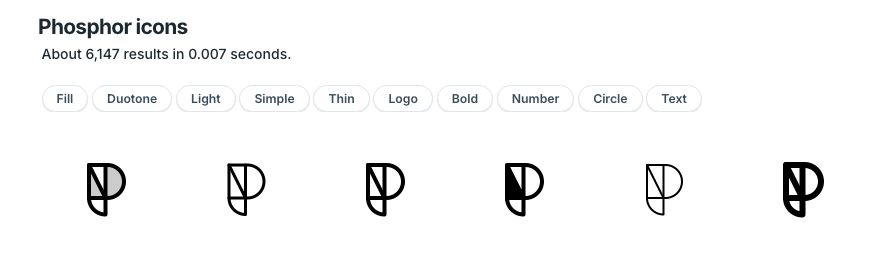
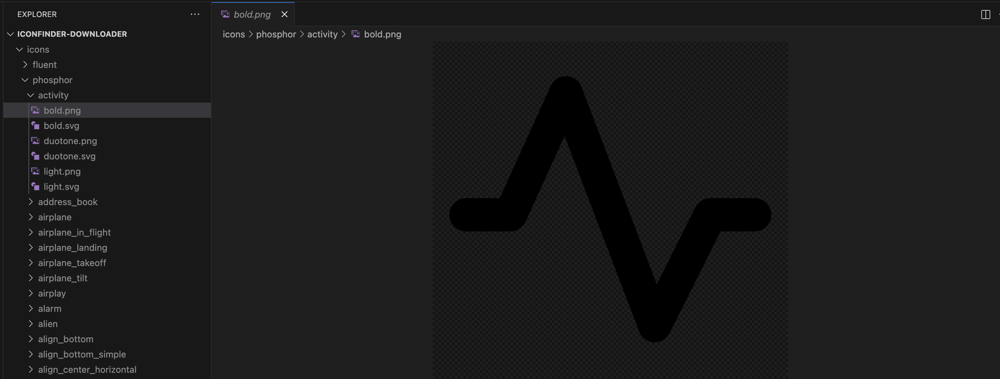

# Iconfinder Downloader Script

With Iconfinder closing on November 15th and not all icons being transferred to Freepik, this script allows you to download all icons from a given Iconfinder link into a local folder.

# How It Works

The script scrapes a given link and creates folders for each icon, organized by different styles and formats.

For example, for Phosphor icons: each icon may be available in one or more of the following styles: regular, duotone, light, fill, thin, bold.



The script creates a folder for each icon (e.g., `icons/phosphor/logo`) and saves each icon in two formats: SVG and 1024px PNG. The files are named after the style, e.g., `icons/phosphor/logo/regular.svg`.

This is much faster than downloading each of the 6,147 Phosphor icons individually.

Currently, the script works only for phosphor and fluent icons, which have defined configurations, but it can handle any Iconfinder link that contains a grid of icons (e.g., [https://www.iconfinder.com/search?q=happy](https://www.iconfinder.com/search?q=happy)).



# Important Information

- The script does **not** download premium icons, even if you have purchased them.
- It waits 2–5 seconds between downloads.
- If a "too many requests" error occurs, the script waits 70–100 seconds and retries. It will attempt 5 times before skipping the icon. If the error persists after 350–500 seconds, the icon is skipped.
- Premium icons are automatically skipped.
- The script works in two phases:
  1. Collecting all icon links and creating a cache file.
  2. Downloading icons using the cache links.
  
  Cache files for Phosphor and Fluent are already included in this repository. For these two families, you can start directly from the second phase. For other families, the script must scrape links first.
- The script can be stopped anytime during the second phase and resumed without losing progress. Already downloaded icons are skipped. If stopped during the first phase, progress is lost unless the cache is saved.
- Multiple icon families can be downloaded simultaneously.
- Faulty images can be deleted and redownloaded.
- If you see "Corrupted file detected"-error, that is okay, the file will be redownloaded automatically, it restarts the session and tries again, it might take several attempts.

# Running the Project for Phosphor or Fluent

In the root of the project, run the following commands:

```bash
python3 -m venv venv
source venv/bin/activate
pip install -r requirements.txt
python unified.py phosphor
deactivate
```

Replace <code>phosphor</code> with <code>fluent</code> if needed.

This process will:

- Create and activate a virtual environment.
- Run the scraper.
- Clean up corrupted files (some files may appear corrupted without warning).
- Reinstall corrupted files.

# Running the Project for Another Icon Family

To download a different family:

<ol>

<li>Create a configuration file, e.g., <code>configuration_jumpicon.json</code>.

Fill the fields as follows:
- <code>family</code> – the name of the family.
- <code>target_url</code> – the search URL containing the grid of icons (e.g., https://www.iconfinder.com/search?q=jumpicon&price=free). Do not use a collection URL (e.g., https://www.iconfinder.com/Ayub_Irawan).
- <code>link_css</code>, <code>scroll_pause_time</code>, <code>max_scrolls</code>, <code>headless_mode</code> – copy these from <code>configuration_fluent.json</code> unless the layout has significantly changed.
- <code>icon_dir</code> – where icons will be saved.
- <code>icon_types</code> – the styles used to group icons. If styles are defined, they correspond to the word before <i>_icon</i> in the file name (e.g., mask_light_icon → style light). If no styles are defined, leave the array empty.
- <code>links_file</code> – the cache file for storing icon links.
- <code>prefix_to_remove</code> – optional prefix that should be removed from icon names (e.g., ic_fluent_). 
</li>

<li>

Run the downloader using the new configuration:

```bash
python unified.py <configuration name>
```

Replace <configuration name> with the name of your configuration file (part after <i>configuration_</i>, like <i>jumpicon</i> in our case).
</li>

</ol>

# Running the Project for a Custom Link

To download all icons from a specific URL without linking to a family:

<ol>

<li>Create a configuration file as described above.</li>

<li>Set <code>target_url</code> to the desired URL.</li>

<li>Leave <code>icon_types</code> empty.</li>

<li>Leave <code>prefix_to_remove</code> as an empty string.</li>

<li>Run the script as in the previous section:

```bash
python unified.py <configuration name>
```
</li>
</ol>

This allows you to download any set of icons directly from a URL, without requiring a predefined family.


